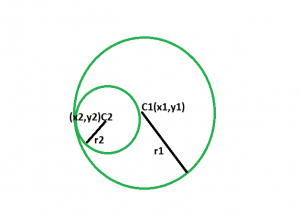

# Maze 3D Collaborative Learning on shared task
___
Contact: ligerfotis@gmail.com
___

Maze 3D game from: https://github.com/amengede/Marble-Maze

Reinforcement Learning (RL) Agent: Soft Actor Critic (SAC)
  * based on [SLM Lab code](https://github.com/kengz/SLM-Lab)
  * modifications based on [Christodoulou](https://arxiv.org/abs/1910.07207) for discrete action space

### Learn the task collaboratively

* (Recommended) create a python virtual environment
    
        python3 -m venv env
        source venv/bin/activate
        pip install -r requirements.txt
    

* Adjust the hyperparameters in the `config_sac.yaml` or the `config_human.yaml` file
    * Note 1: Only discrete SAC is compatible with the game so far
    * Note 2: There are already configuration files set up based on the PETRA 21 short paper in the `config/` directory
  

* Control
    * Use left and right arrows to control the tilt of the tray around its vertical(y) axis
    * Press once the spacekey to pause and a second time to resume
    * Press q to exit the experiment.
  

* Get Familiar with the game
  * Run the command bellow to play 10 trials with the game controlling both DOF (up, down , left, right) with the keyboard's arrows.
  
          python maze3d_human_only_test.py config/config_human_test.yaml

* Train
  *  Notes before training: 
     * substitute the `participant_name` in each config file with your own
     * the program will automatically create an identification number after your name on each folder name created
  *  With the **RL agent**:
        
          python sac_maze3d_train.py config/config_sac_<experiment_specifications>.yaml
     
  * With a **Second human**:
        
        python sac_maze3d_train.py config/config_human.yaml  

#### Game Overview

##### Game Specifications
* Board
    * Square with side size: 320 pixels
    * Board Area: 102400 pixels
    * Free Board Area (excluding walls): 58368 pixels
  
* Wall Cubes
  * Cubes with edge size: 32 pixels
  * Cube bottom Area: 1024 pixels

* Ball
  * sphere with radius ρ2: 16 pixels
  * ball Area: 805 pixels
  
* Goal
  * Circle with center c1:(-104, -104) and radius ρ1: 22 pixels
  * goal Area: 1521 pixels
  
* Ratios
  * Goal - Free Board: ~ 2.6%
  * Ball - Goal:  ~ 53%
  
* Goal reached if ball's whole projection area on the board falls in the goal's area
    

