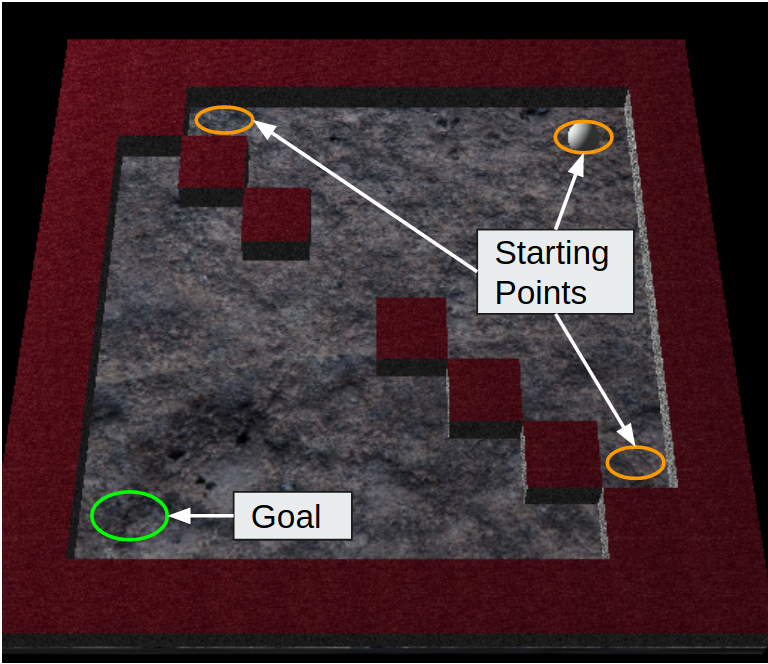

# Maze 3D Collaborative Learning on shared task

Maze 3D game from: https://github.com/amengede/Marble-Maze
Reinforcement Learning (RL) Agent: Soft Actor Critic (SAC)

(work still in progress)

### Learn the task collaboratively

* (Recommended) create a python virtual environment
    
        python3 -m venv env
        source venv/bin/activate
        pip install -r requirements.txt
    
* Adjust the hyperparameters in the `config_sac.yaml` or the `config_human.yaml` file
    * Note: Discrete SAC is only compatible with the game so far
* Train
  *  With the **RL agent**:
        
          python sac_maze3d_train.py config_sac.yaml
     
  * With a **Second human**:
        
        python sac_maze3d_train.py config_human.yaml
  
* Use left and right arrows to control the tilt of the tray around its vertical(y) axis

